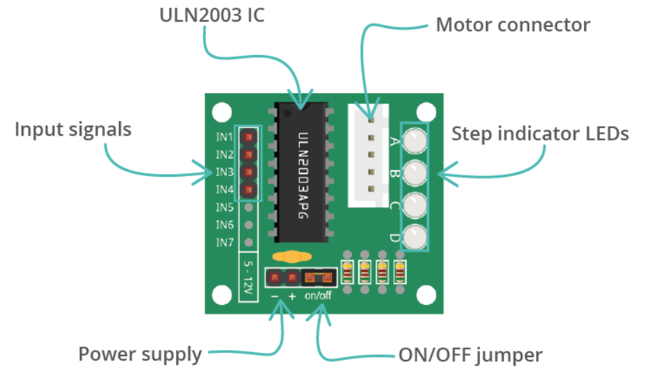

# STM32 ULN2003 Stepper Motor Control Library

This project demonstrates how to control a stepper motor using the ULN2003 driver module with an STM32F4 microcontroller (tested on STM32F407VG). The project uses STM32 HAL libraries and is written in C.

<div style="text-align: center;">
  
</div>
This is ULN2003 Module

## Features

- Supports half-step mode (8-step sequence) for smooth operation
- Simple API to initialize, rotate and stop the motor
- Configurable number of steps and rotation direction
- Portable and easily extendable for other STM32 series

## Hardware Requirements

- STM32F407VG (or compatible STM32 board)
- ULN2003 stepper motor driver module
- 28BYJ-48 stepper motor (or compatible motor)
- External 5V power supply (recommended)
- Jumper wires

## Pin Connection

| STM32 Pin | ULN2003 INx |
|-----------|-------------|
| PA4       | IN1         |
| PA5       | IN2         |
| PA6       | IN3         |
| PA7       | IN4         |

## Software Structure

- `uln2003.h` — Header file containing data structures, enums, and function prototypes.
- `uln2003.c` — Source file implementing the motor control functions.
- `main.c` — Example main program demonstrating how to use the library.

## 🛠️ Project Structure

```
ULN2003/
  ├── Inc/
  │   └──uln2003.h
  └── Src/
      └── uln2003.c
```

---

## Example Code

```c
#include "uln2003.h"

ULN2003_HandleTypeDef hstepmotor = {
    .IN1 = {GPIOA, GPIO_PIN_4},
    .IN2 = {GPIOA, GPIO_PIN_5},
    .IN3 = {GPIOA, GPIO_PIN_6},
    .IN4 = {GPIOA, GPIO_PIN_7},
};

uln2003_Init(&hstepmotor);
uln2003_RunSteps(&hstepmotor, 2048, ULN2003_DIRECTION_FORWARD);
HAL_Delay(1000);
uln2003_RunSteps(&hstepmotor, 2048, ULN2003_DIRECTION_BACKWARD);
HAL_Delay(1000);
```

## API Description

- `uln2003_Init`: Initializes the motor pins and configures GPIO.
- `uln2003_RunSteps`: Rotates the motor by given step count.
- `uln2003_Stop`: Turns off all motor coils (optional).

## Direction Enum

```c
typedef enum {
    ULN2003_DIRECTION_FORWARD,
    ULN2003_DIRECTION_BACKWARD
} ULN2003_DIRECTION;
```

## Notes

- The default delay between steps is 2ms.
- You can adjust the delay to control speed.
- Make sure your power supply can handle the current drawn by the motor.
---

## License

This project is licensed under the MIT License. See the [LICENSE](LICENSE) file for details.
<hr>

## ✍️ Developer

**Semi Eren Gökyıldız**
